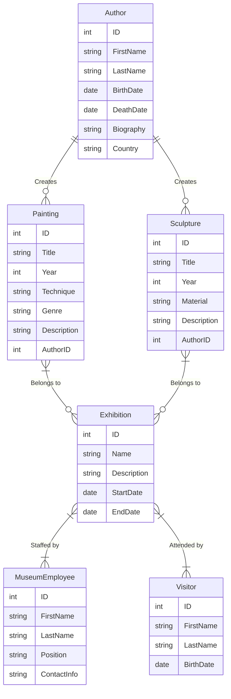

```mermaid
erDiagram
    Author {
        int ID
        string FirstName
        string LastName
        date BirthDate
        date DeathDate
        string Biography
        string Country
    } 
    Painting {
        int ID
        string Title
        int Year
        string Technique
        string Genre
        string Description
        int AuthorID
    }
    Sculpture {
        int ID
        string Title
        int Year
        string Material
        string Description
        int AuthorID
    } 
    Exhibition {
        int ID
        string Name
        string Description
        date StartDate
        date EndDate
    } 
    MuseumEmployee {
        int ID
        string FirstName
        string LastName
        string Position
        string ContactInfo
    } 
    Visitor {
        int ID
        string FirstName
        string LastName
        date BirthDate
    }

    Author ||--o{ Painting : "Creates"
    Author ||--o{ Sculpture : "Creates"
    Painting }|--o{ Exhibition: "Belongs to"
    Sculpture }|--o{ Exhibition : "Belongs to"
    Exhibition }|--|{ MuseumEmployee: "Staffed by"
    Exhibition }|--|{ Visitor : "Attended by"
```
