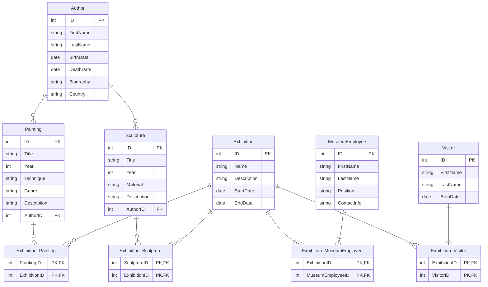

```mermaid
erDiagram
    Author {
        int ID PK
        string FirstName
        string LastName
        date BirthDate
        date DeathDate
        string Biography
        string Country
    } 
    Painting {
        int ID PK
        string Title
        int Year
        string Technique
        string Genre
        string Description
        int AuthorID FK
    }
    Sculpture {
        int ID PK
        string Title
        int Year
        string Material
        string Description
        int AuthorID FK
    } 
    Exhibition {
        int ID PK
        string Name
        string Description
        date StartDate
        date EndDate
    } 
    MuseumEmployee {
        int ID PK
        string FirstName
        string LastName
        string Position
        string ContactInfo
    } 
    Visitor {
        int ID PK
        string FirstName
        string LastName
        date BirthDate
    }
    Exhibition_Painting {
        int PaintingID PK, FK
        int ExhibitionID PK, FK
    }
    Exhibition_Sculpture {
        int SculptureID PK, FK
        int ExhibitionID PK, FK
    }
    Exhibition_MuseumEmployee {
        int ExhibitionID PK, FK
        int MuseumEmployeeID PK, FK
    }
    Exhibition_Visitor {
        int ExhibitionID PK, FK
        int VisitorID PK, FK
    }

    Author ||--o{ Painting : ""
    Author ||--o{ Sculpture : ""
    Painting ||--o{ Exhibition_Painting: ""
    Sculpture ||--o{ Exhibition_Sculpture : ""
    Exhibition ||--o{ Exhibition_Painting: ""
    Exhibition ||--o{ Exhibition_Sculpture : ""
    Exhibition ||--|{ Exhibition_MuseumEmployee: ""
    Exhibition ||--|{ Exhibition_Visitor : ""
    MuseumEmployee ||--|{ Exhibition_MuseumEmployee : ""
    Visitor ||--|{ Exhibition_Visitor : ""
```
